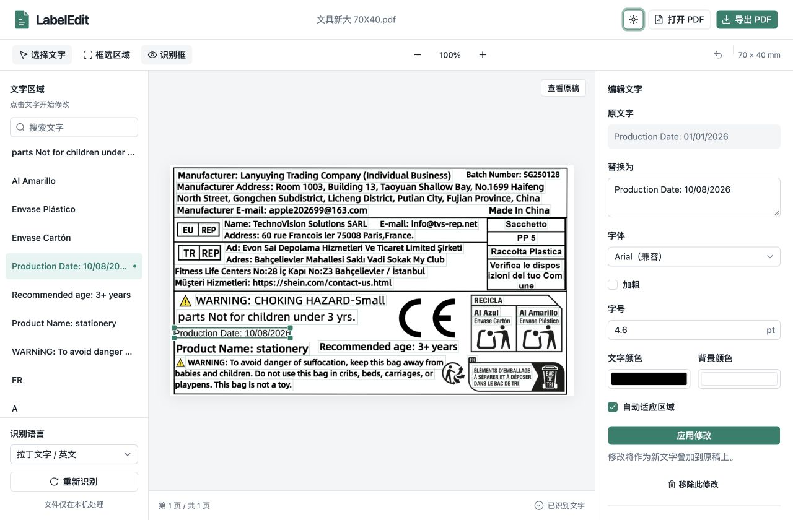
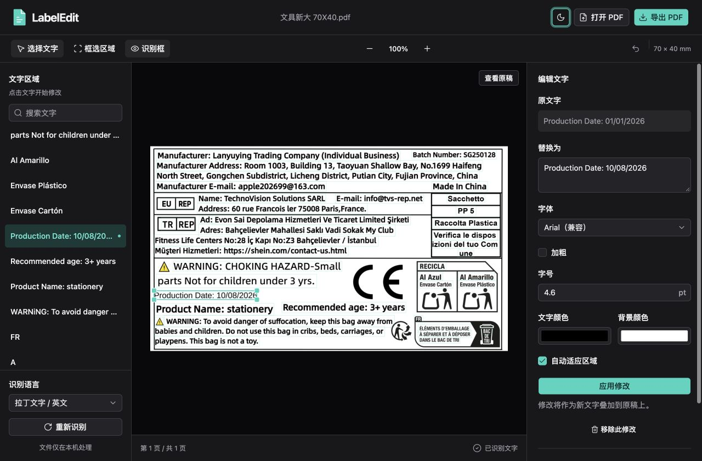
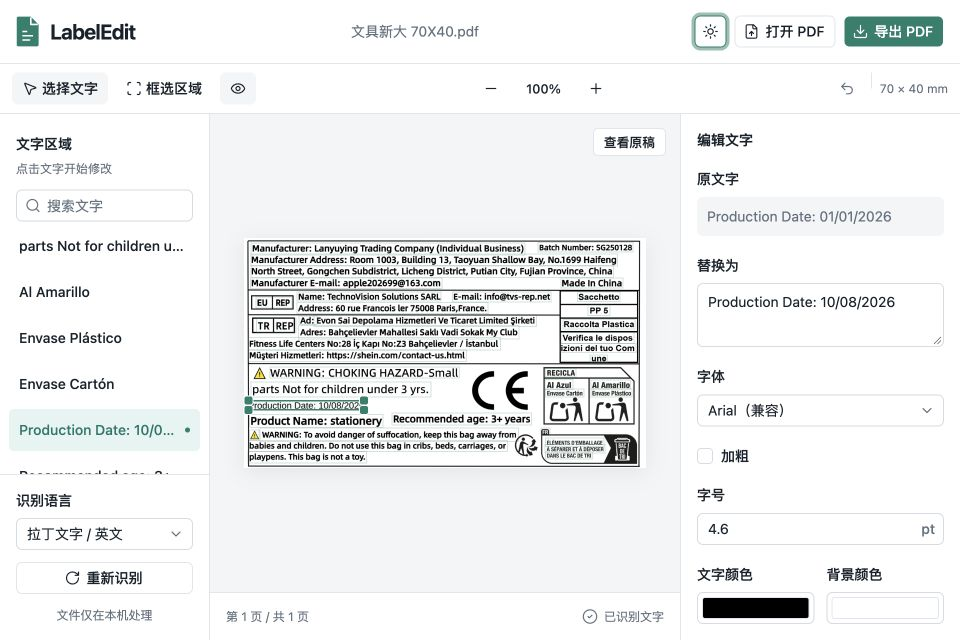
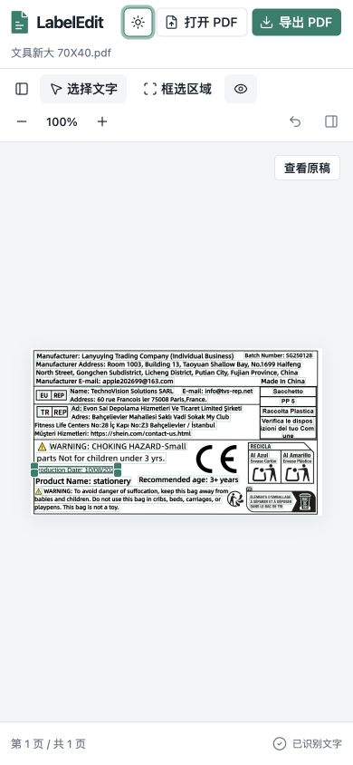
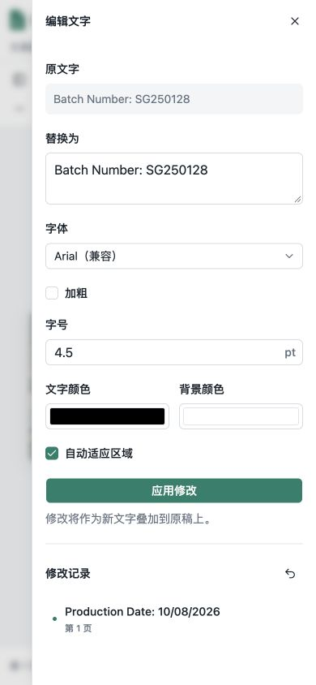

# 整理、瘦身与 UI 迁移验证记录

日期：2026-10-08。基线：`55ab934`，版本仍为 0.1.2。功能分支：`codex/editor-cleanup-and-ui`。

## 分阶段变更

1. `38db17e`：reducer 编辑状态、坐标与文档类型、画布交互、预览资源生命周期、后端连接和按需加载的桌面更新模块；移除 dialog/shell 插件和未使用的直接 Tokio 依赖。
2. `3d2e596`：运行/测试/打包依赖分离，干净隔离环境、固定 PyInstaller 6.22.3、共享跨平台构建脚本，排除闲置 OCR 默认模型与 ONNX 示例数据。
3. `ec60f89`：shadcn/ui 官方 Base Nova、Tailwind CSS 4、系统字体、浅色/深色/系统主题与窄屏侧栏，清除被替代的控件样式。
4. `2c31685`：Windows CI 发现原预览接口会重新打开仍持有写入句柄的临时 PDF，改为写入并关闭后再渲染；HTTP 字段和坐标语义保持兼容。
5. `5fdef2e`、`e81307a`：验证流水线遇到失败立即停止，并测试最终 macOS 应用目录及 Windows NSIS 安装目录中的离线资源。

## 同平台体积实测

本机 macOS Apple Silicon。基线后端和优化后端使用同一个干净 Python 3.12 环境及固定打包依赖，分别运行旧/新 spec。两套前端与 Tauri 应用均重新构建，关闭此次验证构建的 updater artifacts；正式发行配置保持启用。

目录按非符号链接的普通文件长度求和，DMG 按文件长度计量；1 MiB = 1,048,576 bytes。原生库与字体没有手工裁切。

| 产物 | 基线 MiB | 优化后 MiB | 减少 MiB | 减少比例 |
| --- | ---: | ---: | ---: | ---: |
| 独立后端 | 335.70 | 305.42 | 30.28 | 9.02% |
| 完整 .app | 436.39 | 403.42 | 32.96 | 7.55% |
| 压缩 DMG | 204.38 | 177.69 | 26.70 | 13.06% |

精确 bytes：后端 352,006,561 → 320,256,133；应用 457,585,286 → 423,020,538；DMG 214,313,153 → 186,318,628。同平台压缩收益小于独立资源收益。

新增组件库增加了前端体积：全部 JS gzip 84,032 → 173,200 bytes，CSS gzip 5,178 → 13,030 bytes，合计增加约 94.75 KiB。UI primitives 独立为共享 chunk；桌面更新插件仍按需加载。上表完整应用/安装包已经包含该增加。

本机对照产物位于忽略目录 `output/baseline-backend`、`output/baseline-desktop`；最终产物位于 `src-tauri/target/release/bundle/macos` 和 `dmg`，机器可读体积数据为 `output/size-comparison.json`。

## 回归验证

| 检查 | 结果 |
| --- | --- |
| Vitest | 13 项通过：移动边界、缩放手柄、连续微调撤销、操作前刷新位置、过期预览、预览失败回滚、快捷键隔离、草稿保留与重置、主题保存和系统变化 |
| 前端构建 | `npm run build` 通过，TypeScript 与 Vite 无构建错误 |
| Python | 5 项测试与 4 个 subtests 通过 |
| Rust | `cargo check --manifest-path src-tauri/Cargo.toml` 通过 |
| macOS 打包 | 最终 .app、DMG 构建通过；原生应用载入并识别示例标签，修改日期生成实际预览 |
| 打包资源断网验证 | 通过 sandbox-exec 禁止外部联网，在项目外临时目录启动应用内后端；中英文 OCR、Latin/Chinese 常规与粗体字体、预览、导出、下载和 70×40 mm 页面尺寸通过 |
| macOS / Windows CI | [最终验证流水线](https://github.com/ZhiPenTu/LabelEdit/actions/runs/37726093950) 全部通过，对应应用及构建代码 `e81307a` |
| Windows 安装包 | NSIS 构建、静默安装、安装目录后端断网测试全部通过；包含两种 OCR、四种字体、预览、导出、下载和原始页面尺寸 |

浏览器使用 Codex IAB，测试 Vite 开发版本及 `http://127.0.0.1:4173` 生产构建。流程：文件选择器打开两页扫描 PDF → 英文识别 → 修改/加粗 → 第二页切换中文引擎 → 中文修改 → 手动框选并添加中文粗体 → 跨页返回 → 下载 PDF。读取下载文件验证两页内容含实际修改，两个页面都保留 70×40 mm。

另外验证选择/拖动、四角缩放、连续三次方向键微调后一次撤销、原稿对照、菜单/文本框方向键隔离、主题刷新保存、模拟系统主题变化即时响应、窄屏文字列表跳转编辑器、Escape 关闭后焦点恢复、草稿跨关闭及布局切换保留。浅色/深色均保持白色 PDF 页面及文档颜色。

1280×840、960×640 和 390×844 均检查布局；页面无横向溢出，侧栏内容可滚动。页面标题/内容正确，无空白页或框架错误遮罩；最终浏览器控制台无相关 error/warn。最小桌面窗口保留三栏，网页小于 960 px 使用 Sheet。

## 复现

```bash
npm ci
npm run test
npm run build
.venv/bin/python -m pytest -q
cargo check --manifest-path src-tauri/Cargo.toml
.venv/bin/python scripts/build_backend.py
CI=true npx tauri build --bundles app,dmg --config '{"bundle":{"createUpdaterArtifacts":false}}'
.venv/bin/python scripts/smoke_desktop.py
```

CI 使用 `.github/workflows/validate.yml`，只构建、测试和保存产物。Windows 会静默安装 NSIS，再对安装后的后端执行防火墙阻断外网的同一验证。不触发正式发行，不执行应用内自动更新或重启。Windows 原生 GUI 人工验收不包含在 CI 中。

## 界面证据






